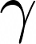
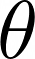
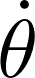
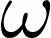
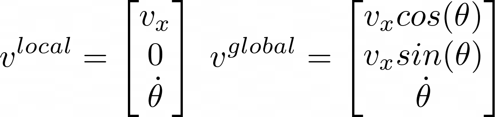

#### A differential drive robot (DDR) is a type of mobile robot with two, seperately motorized, wheels. We will discuss the motion model for a DDR and make a simple simulator that will help us interact with the motion model.
<div align="center">
  <p>
    
  </p>
     DDR simulator we will create (GIF format worsens frame rate, real sim is smoother)
</div>

Motion models are mathematical models that describe the behavior of robots. There are two main types: kinematic models and dynamic models. Today we will be focusing on the former.
## Kinematics and Inverse Kinematics:
Kinematic models can be approached in two ways: forward kinematics (or simply kinematics) and inverse kinematics. Forward kinematics takes input values and predicts the path of the robot, whereas inverse kinematics defines a desired path and attempts to find the inputs necessary to achieve this path.

In the context of DDR, a forward kinematic model would use user inputs of linear and angular velocity to model the behavior of the robot. On the other hand, an inverse kinematic model would start with a laid out path that we desire our robot to follow, and would then calculate the necessary linear and angular velocity inputs to achieve such a path.


## Global and Local Reference Frames:
Before we discuss motion models, it's important to consider the context in which we're referring to these models. The local frame (also known as the body frame) situates the DDR in its own xyz-plane. In this frame, the linear velocity is in the x-direction, rotation occurs about the z-axis, and the y-coordinate is always zero. The displacement of the DDR isn't taken into consideration in the local frame.

In contrast, the global frame situates the DDR in a broader xy-plane, where its movements are relative to its environment. For example, if we place two DDRs in a field and aim to avoid a collision, we need to use a global frame to track their positions. A local frame would only provide information for each robot in isolation, and wouldn't account for their relative positions in the shared environment.
<div align="center">
  <p>
    
  </p>
  X<sub>R</sub> and Y<sub>R</sub> indicate the local frame and X<sub>I</sub> and Y<sub>I</sub> indicate the global frame
  </div>
  
## Motion Models:  
Now to the good stuff. Given that we are dealing with two distinct reference frames — global and local — we will use two separate motion models. If this ever gets fuzzy, just remember that we are primarily focusing on two simple concepts: linear velocity and angular velocity. Linear velocity refers to the derivative of position with respect to time, while angular velocity corresponds to the derivative of angular displacement with respect to time.
### Local frame: linear velocity
Linear velocity in the local frame is quite simple. We have no y-component since wheels do not slide and the z-axis is where we rotate, meaning our linear velocity is always in the x-direction. Say we have a path (s), the linear velocity can be modeled as: 
 <div align="center">
 <p>

  </p>
</div>

The linear velocity is tangent to the path 

### Global frame: linear velocity
Linear velocity in the global frame is only slightly more complex. We will now take  under consideration to find our velocity: 
<div align="center">
  <p>
    
  </p>
  </div>
  
   The heading of our DDR is in the direction of . hence, our x and y components of our linear velocity are in terms of cos and sin.

### Angular velocity: 
To find our angular velocity, 
  we will take the time dependent derivative of . We will refer to it as . In other words:  = . The DDR rotates about the z-axis both globally and locally, so unlike the linear velocity we have one value that applies to both reference frames.

### Final model:
It is common to combine angular velocity and linear velocity into one vector. Our DDR motion model is:
<div align="center">
  <p>
    
  </p>
</div>

## Creating a Simulator:
  Although there are plenty of complex tools we can use to model various DDR's, let us create one of our own. We will be using the pygame library to make our simulator:
  ``` bash
  import pygame
import sys
import math

pygame.init()

WIDTH, HEIGHT = 640, 480 # adjust sim window size

# adjust speed of controls
LINEAR_SPEED = 1  
ANGULAR_SPEED = 0.02  

FPS = 60
MAX_TRACERS = 70  # tracers are the trail that is left behind by the DDR in the sim 
DT = 1.0 / FPS  
TWO_PI = 2 * math.pi  

screen = pygame.display.set_mode((WIDTH, HEIGHT))

# initializes starting dot position and direction 
dot_position = [WIDTH // 2, HEIGHT // 2] 
direction = 0 
old_direction = direction  

dot_positions = []

clock = pygame.time.Clock()

font = pygame.font.Font(None, 36)  
font1 = pygame.font.Font(None, 20) 

running = True
while running:
    screen.fill((0, 0, 0))  # mess with this if you want to change background color

    text = font.render("DDR Motion Simulator", True, (255, 255, 255)) 
    screen.blit(text, (10, 10))  
    text1 = font1.render("Linear velocity controls: 'W' and 'S' keys ", True, (255, 255, 255)) 
    screen.blit(text1, (10, 50))  
    text1 = font1.render("Angular controls: 'A' and 'D' keys ", True, (255, 255, 255))  
    screen.blit(text1, (10, 70)) 

    theta = math.degrees(direction)
    text2 = font1.render(f"Current angle (theta): {theta:.2f} degrees", True, (255, 255, 255)) 
    screen.blit(text2, (10, 90))  
   
    # event handling loop
    for event in pygame.event.get():
        if event.type == pygame.QUIT:
            running = False
            
    # sees which keys are pressed
    keys = pygame.key.get_pressed()
    
    # checks if WASD is pressed. W and S moves forward and back, A and D change the direction in which the dot is pointing
    linear_vel = 0
    if keys[pygame.K_w]:
        dot_position[0] += LINEAR_SPEED * math.cos(direction)
        dot_position[1] -= LINEAR_SPEED * math.sin(direction)
        linear_vel = LINEAR_SPEED
    if keys[pygame.K_s]:
        dot_position[0] -= LINEAR_SPEED * math.cos(direction)
        dot_position[1] += LINEAR_SPEED * math.sin(direction)
        linear_vel = -LINEAR_SPEED
    if keys[pygame.K_d]:
        direction = (direction - ANGULAR_SPEED) % TWO_PI
    if keys[pygame.K_a]:
        direction = (direction + ANGULAR_SPEED) % TWO_PI
    # calculates angular velocity by taking derivative of direction
    angular_vel = (direction - old_direction) / DT
    # calculates local velocity and rounds it to two decimal places
    local_velocity = (round(100 * linear_vel) / 100, 0, round(100 * angular_vel) / 100)
   
    # displaying the local and global velocity
    text3 = font1.render(f"Local velocity: {local_velocity}", True, (255, 255, 255))  
    screen.blit(text3, (10, 110))  
   
    global_velocity = (round(100 * linear_vel * math.cos(direction)) / 100, round(100 * linear_vel * math.sin(direction)) / 100, round(100 * angular_vel) / 100)
    
    text4 = font1.render(f"Global velocity: {global_velocity}", True, (255, 255, 255)) 
    screen.blit(text4, (10, 130))  

    dot_positions.append(list(dot_position))
   
    # makes sure we do not exceed the max number of tracer dots
    if len(dot_positions) > MAX_TRACERS:
        dot_positions.pop(0)
    
    #draws yellow circle for each position of the tracers
    for pos in dot_positions:
        pygame.draw.circle(screen, (255, 255, 0), pos, 1)
        
    # draws main blue dot
    pygame.draw.circle(screen, (0, 0, 255), dot_position, 5)
    
    pygame.display.flip()
    
    old_direction = direction
 
    clock.tick(FPS)

pygame.quit()
```

We now have a simple way to interact with the DDR motion model. I recommend you find the values manually to see if they match the simulator values to make sure you understand how to calculate them by hand.

I hope you learned something. Keep building.
  
